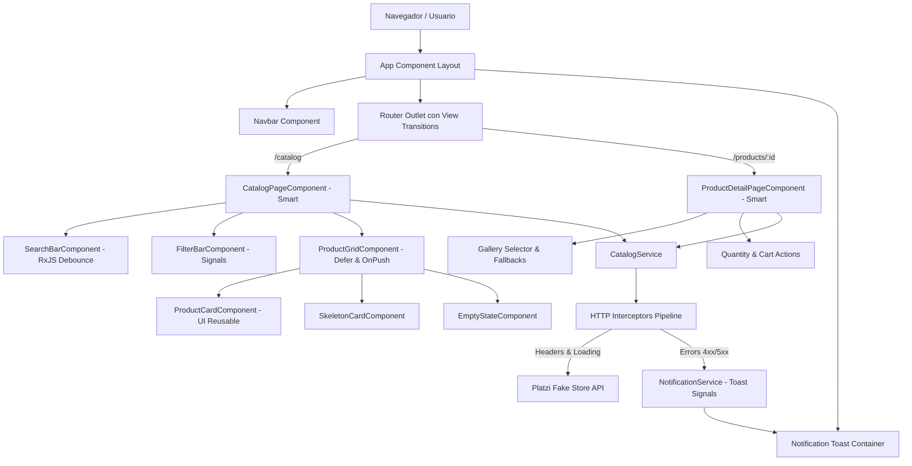

# 🧭 PROJECT CONTEXT & ARCHITECTURAL SPECIFICATION

> **Destinatarios:** Asistentes de IA (LLMs), Agentes Autónomos y Desarrolladores de Software.  
> **Objetivo:** Proporcionar una comprensión técnica integral, precisa y exhaustiva de la arquitectura, estructura de archivos, patrones de diseño, flujo de datos, tecnologías y convenciones empleadas en este proyecto.

---

## 1. 📋 Resumen Ejecutivo y Ficha Técnica

| Parámetro | Detalle |
| :--- | :--- |
| **Nombre del Proyecto** | `catalogo` (Apex Store - Catálogo E-Commerce Platzi) |
| **Tipo de Aplicación** | Single Page Application (SPA) Web Frontend de Alto Rendimiento |
| **Framework Base** | **Angular 19** (19.2.0) |
| **Arquitectura de Componentes** | 100% **Standalone Components** (Sin `NgModule`) |
| **Estrategia de Reactividad** | **Angular Signals** (`signal`, `computed`, `effect`) + **RxJS Declarativo** |
| **Detección de Cambios** | `ChangeDetectionStrategy.OnPush` en todos los componentes |
| **Sistema de Estilos** | **Tailwind CSS 3.4** + PostCSS + CSS Variables |
| **Tipografía** | Google Fonts (*Inter*, *Plus Jakarta Sans*) |
| **Fuente de Datos Externa** | Platzi Fake Store API (`https://api.escuelajs.co/api/v1/`) |
| **Manejo de Errores** | Interceptores funcionales globales + Sistema de notificaciones Toast reactivo |
| **Resiliencia Multimedia** | Pipes y directivas de saneamiento defensivo contra URLs corruptas de la API |

---

## 2. 🛠️ Stack Tecnológico y Dependencias

### 2.1 Core Dependencies (`package.json`)
- **`@angular/core` & `@angular/common` (v19.2.0):** Núcleo del framework con nuevo Control Flow (`@if`, `@for`, `@defer`) y Signals.
- **`@angular/router` (v19.2.0):** Enrutamiento con lazy-loading moderno, View Transitions API (`withViewTransitions()`) y binding de inputs de ruta (`withComponentInputBinding()`).
- **`@angular/forms` (v19.2.0):** Formularios reactivos (`FormControl`, `ReactiveFormsModule`) para la búsqueda con debounce.
- **`rxjs` (v7.8.0):** Manejo de flujos asíncronos y operadores reactivos (`debounceTime`, `distinctUntilChanged`, `switchMap`, `catchError`).
- **`zone.js` (v0.15.0):** Con `eventCoalescing: true` para optimización de ciclos de detección.

### 2.2 Dev & Build Dependencies
- **`@angular/cli` / `@angular-devkit/build-angular` (v19.2.6):** Compilador y empaquetador esbuild/Vite de Angular.
- **`tailwindcss` (v3.4.19):** Framework utility-first configurado con tokens semánticos personalizados.
- **`typescript` (v5.7.2):** Tipado estricto habilitado en `tsconfig.json`.
- **`angular-cli-ghpages`:** Despliegue automatizado en GitHub Pages.

---

## 3. 📂 Estructura Jerárquica del Proyecto

La aplicación sigue una arquitectura modular escalable dividida en `core`, `shared` y `features`:

```text
catalogo/
├── .agents/
│   └── skills/
│       └── apex-angular/SKILL.md          # Guía de estándares técnicos y buenas prácticas
├── src/
│   ├── index.html                         # HTML principal con meta tags y preconnect de fuentes
│   ├── main.ts                            # Bootstrap standalone: bootstrapApplication(AppComponent, appConfig)
│   ├── styles.css                         # Directivas de Tailwind, importación de fuentes y scrollbars
│   ├── 404.html                           # Redirección SPA para GitHub Pages / servidores estáticos
│   └── app/
│       ├── app.component.ts               # Layout raíz standalone (Navbar + RouterOutlet + Footer + Toasts)
│       ├── app.component.html             # Estructura del layout global
│       ├── app.component.css              # Estilos locales del layout
│       ├── app.config.ts                  # Proveedores globales (Router, HttpClient, Interceptors)
│       ├── app.routes.ts                  # Definición de rutas principales con carga perezosa
│       │
│       ├── core/                          # Módulos singleton, servicios globales, interceptores y contratos
│       │   ├── guards/
│       │   │   ├── numeric-id.guard.ts     # Guard funcional (CanActivateFn) para validar IDs numéricos
│       │   │   └── unsaved-changes.guard.ts# Guard funcional (CanDeactivateFn) para cambios pendientes
│       │   ├── interceptors/
│       │   │   ├── api-headers.interceptor.ts   # Inyecta headers comunes (Content-Type, etc.)
│       │   │   ├── loading.interceptor.ts       # Activa/desactiva el servicio reactivo de carga global
│       │   │   └── error-handler.interceptor.ts # Captura códigos HTTP y emite notificaciones Toast
│       │   ├── models/
│       │   │   ├── product.model.ts        # Interfaces Product, CreateProductDto, UpdateProductDto
│       │   │   ├── category.model.ts       # Interfaz Category
│       │   │   ├── filter-params.model.ts  # Interfaz ProductFilterParams y tipo SortOption
│       │   │   └── api-response.model.ts   # Interfaces ApiResponse, PaginatedResponse, AppError
│       │   └── services/
│       │       ├── catalog.service.ts      # Cliente HTTP para Platzi API + saneamiento de imágenes
│       │       ├── notification.service.ts # Servicio de mensajes Toast reactivo basado en Signals
│       │       └── loading.service.ts      # Servicio de estado de carga con Signals y computeds
│       │
│       ├── shared/                        # Elementos reutilizables sin lógica de negocio acoplada
│       │   ├── components/
│       │   │   ├── navbar/                 # Barra de navegación principal con menú móvil e indicadores
│       │   │   ├── skeleton-card/          # Tarjeta placeholder con animación pulse y efecto shimmer
│       │   │   ├── empty-state/            # Vista de estado vacío con SVG y botón de acción
│       │   │   └── notification-toast/     # Contenedor flotante de notificaciones dinámicas
│       │   ├── pipes/
│       │   │   ├── price-format.pipe.ts    # Formateador de moneda con Intl.NumberFormat
│       │   │   ├── sanitize-image.pipe.ts  # Limpiador de arrays serializados en strings de imágenes
│       │   │   └── truncate-text.pipe.ts   # Truncador inteligente de textos largos
│       │   └── directives/
│       │       └── image-fallback.directive.ts # Fallback automático ante error (404/broken link) en 
│       │
│       └── features/                      # Módulos de funcionalidad y vistas de negocio
│           ├── catalog/                   # Vista principal de exploración y catálogo
│           │   ├── components/
│           │   │   ├── search-bar/        # Input reactivo con FormControl y pipeline RxJS debounce
│           │   │   ├── filter-bar/        # Selector de categorías y ordenamiento con Signals
│           │   │   ├── product-card/      # Tarjeta interactiva con hover effects, badges y precios
│           │   │   └── product-grid/      # Cuadrícula responsiva con @defer y estados vacíos
│           │   ├── pages/
│           │   │   └── catalog-page.component.ts # Smart component con Signals, paginación y orquestación
│           │   └── catalog.routes.ts      # Rutas hijas de catálogo
│           │
│           └── product-detail/            # Vista en detalle del producto
│               ├── pages/
│               │   └── product-detail-page.component.ts # Vista completa: galería interactiva, specs y add to cart
│               └── detail.routes.ts       # Rutas con numericIdGuard: `/products/:id`
│
├── angular.json                           # Configuración del CLI de Angular
├── tailwind.config.js                     # Tokens de diseño, colores brand y animaciones
├── tsconfig.json                          # Configuración raíz de TypeScript
└── package.json                           # Scripts y dependencias del proyecto
```

---

## 4. 🏛️ Arquitectura y Patrones de Diseño



### 4.1 Principios Fundamentales
1. **Componentes Standalone Puros:** Ausencia total de `NgModule`. Todo componente importa explícitamente sus dependencias en el decorador `@Component({ standalone: true, imports: [...] })`.
2. **Inyección Funcional:** Uso estricto de la función `inject(Type)` en lugar de inyección por constructor.
3. **Change Detection OnPush:** Todos los componentes implementan `changeDetection: ChangeDetectionStrategy.OnPush`. El renderizado depende exclusivamente de inmutabilidad y Angular Signals.
4. **Nuevo Control Flow de Angular:** Uso nativo de `@if`, `@else`, `@for (item of items; track item.id)`, `@switch`, `@case`, y bloques `@defer (on viewport)`.

### 4.2 Modelo de Estado Reactivo
- **Signals Primitivos (`signal<T>`):** Controlan el estado mutable local (ej. `searchQuery`, `selectedCategoryId`, `currentPage`, `loading`).
- **Computeds Derivados (`computed<T>`):** Cálculos puros y ordenamiento sin mutar el array original (ej. `sortedProducts`).
- **RxJS Form Streams:** En `SearchBarComponent`, se gestiona un `FormControl` reactivo con `debounceTime(350)` y `distinctUntilChanged()`, evitando llamadas innecesarias a la API y condiciones de carrera.

---

## 5. 🔌 Capa Core: Servicios, Modelos, Guards e Interceptors

### 5.1 Modelos de Datos (`src/app/core/models/`)

#### `Product` (`product.model.ts`):
```typescript
export interface Product {
  id: number;
  title: string;
  price: number;
  description: string;
  images: string[];
  category: Category;
  creationAt?: string;
  updatedAt?: string;
}
```

#### `Category` (`category.model.ts`):
```typescript
export interface Category {
  id: number;
  name: string;
  image: string;
  creationAt?: string;
  updatedAt?: string;
}
```

#### `ProductFilterParams` & `SortOption` (`filter-params.model.ts`):
```typescript
export interface ProductFilterParams {
  title?: string;
  price_min?: number;
  price_max?: number;
  categoryId?: number;
  offset?: number;
  limit?: number;
}

export type SortOption = 'default' | 'price-asc' | 'price-desc' | 'name-asc' | 'name-desc';
```

---

### 5.2 Servicios Core (`src/app/core/services/`)

1. **`CatalogService` (`catalog.service.ts`):**
   - Consume la API de Platzi: `https://api.escuelajs.co/api/v1`.
   - **`getProducts(filters)`**: Lista paginada y filtrada.
   - **`getProductById(id)`**: Obtención de producto individual.
   - **`searchProducts(title)`**: Búsqueda por coincidencia de texto.
   - **`getCategories()`**: Categorías disponibles.
   - **`getProductsByCategory(id, offset, limit)`**: Productos filtrados por categoría.
   - **Saneamiento Defensivo (`cleanImageUrl` / `cleanProductImage`):** Corrige el problema común de la Platzi API donde las imágenes son enviadas como strings JSON malformados (ej. `["[\"https://...\"]"]`).

2. **`NotificationService` (`notification.service.ts`):**
   - Administra una cola de notificaciones tipo Toast con `signal<NotificationMessage[]>`.
   - Métodos públicos: `show()`, `success()`, `error()`, `info()`, `warning()`, `dismiss()`.
   - Auto-cierre configurable (default 4 segundos).

3. **`LoadingService` (`loading.service.ts`):**
   - Contador interno de peticiones activas `signal<number>(0)`.
   - Signal derivado `isLoading = computed(() => this.activeRequests() > 0)`.

---

### 5.3 Interceptores HTTP Funcionales (`src/app/core/interceptors/`)

Registrados en `app.config.ts` mediante `withInterceptors([...])`:

1. **`apiHeadersInterceptor`:** Inyecta cabeceras de contenido estándar en cada petición saliente.
2. **`loadingInterceptor`:** Incrementa y decrementa el contador en `LoadingService` usando el operador `finalize()`.
3. **`errorHandlerInterceptor`:** Captura `HttpErrorResponse` (errores 400, 404, 500 o fallos de red), genera un objeto normalizado `AppError` y lanza automáticamente un Toast de error con `NotificationService`.

---

### 5.4 Guards Funcionales (`src/app/core/guards/`)

- **`numericIdGuard` (`CanActivateFn`):** Valida que el parámetro de ruta `:id` en `/products/:id` sea un número entero positivo. Si no es válido, notifica al usuario con un Toast de advertencia y redirige a `/catalog`.
- **`unsavedChangesGuard` (`CanDeactivateFn`):** Valida formularios pendientes antes de salir de una vista.

---

## 6. 🎨 Sistema de Diseño y Tokens (Tailwind CSS)

### 6.1 Paleta Semántica (`tailwind.config.js`)

```javascript
colors: {
  brand: {
    primary: '#081c15',    // Verde profundo / Header / Alto contraste
    secondary: '#184322',  // Estructuras / Hover / Botones secundarios
    accent: '#036666',     // Acciones principales / Badges / Focus rings
    surface: '#EBF2FA',    // Fondos neutros suaves / Tags / Badges claros
    success: '#2ECC71',    // Verde Esmeralda / Éxito / Notificaciones Toast y aprobaciones
  }
}
```

### 6.2 Utilidades y Animaciones
- **Fuente Sans:** `Inter`, `Plus Jakarta Sans`, sans-serif.
- **Keyframe `shimmer`:** Animación de carga continua para los skeletons.
- **Microinteracciones:** Transiciones fluidas (`transition-all duration-200 ease-in-out`), hover scales (`hover:scale-[1.02]`), bordes con alpha (`border-slate-200/80`).

---

## 7. 🧩 Capa Shared: Componentes, Directivas y Pipes

### 7.1 Componentes Reutilizables
- **`NavbarComponent`:** Encabezado sticky con backdrop-blur, logo, enlaces de navegación, indicador de carga global y badge de productos en carrito.
- **`SkeletonCardComponent`:** Recrea fielmente la anatomía de una tarjeta de producto (imagen 4:3, badges, título, precio, botón) con animación `animate-pulse` y shimmer.
- **`EmptyStateComponent`:** Renderiza ilustraciones SVG, título explicativo, mensaje amigable y botón de acción para resetear filtros.
- **`NotificationToastComponent`:** Contenedor con animación de entrada lateral, colores semánticos por tipo (éxito, error, advertencia, info) y botón de cierre manual.

### 7.2 Pipes Personalizados (Pure & Optimized)
- **`PriceFormatPipe` (`priceFormat`):** Utiliza `Intl.NumberFormat('en-US', { style: 'currency', currency: 'USD' })` para garantizar formato monetario preciso.
- **`SanitizeImagePipe` (`sanitizeImage`):** Detecta arrays o strings de URLs sucias, limpia escapes de comillas y provee un placeholder seguro si la imagen es inválida.
- **`TruncateTextPipe` (`truncateText:length`):** Trunca descripciones largas respetando el límite de caracteres y añadiendo puntos suspensivos (`...`).

### 7.3 Directivas Defensivas
- **`ImageFallbackDirective` (`[appImageFallback]`):** Escucha el evento `(error)` nativo del elemento `` y reemplaza automáticamente la fuente con un placeholder elegante (`https://placehold.co/...`), previniendo imágenes rotas en la UI.

---

## 8. 🚀 Flujo de las Vistas Principales (Features)

### 8.1 Catálogo (`features/catalog/pages/catalog-page.component.ts`)
1. Al inicializar (`ngOnInit`), carga categorías (primeras 8) y productos.
2. La barra de búsqueda (`SearchBarComponent`) emite eventos con debounce para buscar por título.
3. La barra de filtros (`FilterBarComponent`) permite seleccionar categoría o cambiar el ordenamiento (`price-asc`, `price-desc`, `name-asc`, `name-desc`).
4. Los productos se procesan con `computed()` para aplicar el ordenamiento en memoria de forma ultra-rápida.
5. El grid (`ProductGridComponent`) muestra `SkeletonCardComponent` mientras `loading() === true`. Si no hay resultados, renderiza `EmptyStateComponent`.
6. Incluye controles de paginación previa/siguiente con `pageSize = 12`.

### 8.2 Detalle de Producto (`features/product-detail/pages/product-detail-page.component.ts`)
1. La ruta `/products/:id` está protegida por `numericIdGuard`.
2. Lee el parámetro `:id` y obtiene los datos del producto vía `CatalogService.getProductById(id)`.
3. Dispone de selector interactivo de galería para cambiar la imagen principal activa.
4. Selector de cantidad con incremento/decremento reactivo y cálculo dinámico de precio total.
5. Botón de agregar al carrito con notificación Toast interactiva.
6. Enlace de navegación / breadcrumb para regresar al catálogo.

---

## 9. 🤖 Guía y Reglas para Otras IAs al Modificar este Proyecto

Cuando generes, refactorices o extiendas código en este repositorio, **debes cumplir obligatoriamente con las siguientes directrices**:

1. ❌ **PROHIBIDO crear o utilizar `NgModule`:** Todo nuevo componente, pipe o directiva debe ser `standalone: true`.
2. ❌ **PROHIBIDO usar constructores para DI:** Usa siempre `private readonly myService = inject(MyService);`.
3. ❌ **PROHIBIDO `ChangeDetectionStrategy.Default`:** Todo componente nuevo debe especificar `changeDetection: ChangeDetectionStrategy.OnPush`.
4. ✅ **Priorizar Angular Signals:** Usa `signal()`, `computed()` y `effect()` para el estado local y reactivo.
5. ✅ **Usar Modern Control Flow:** Escribe `@if`, `@else`, `@for (item of list; track item.id)`, `@switch`, `@empty` y `@defer`. No uses directivas estructurales antiguas como `*ngIf` o `*ngFor`.
6. ✅ **Tailwind CSS Semántico:** Utiliza las clases de color `text-brand-primary`, `bg-brand-accent`, `bg-brand-surface`, etc., en lugar de colores arbitrarios.
7. ✅ **Manejo Defensivo de Datos:** Aplica siempre `ImageFallbackDirective` o `SanitizeImagePipe` al renderizar imágenes de la Platzi Fake Store API.
8. ✅ **Guards e Interceptors Funcionales:** Nuevos guards deben ser de tipo `CanActivateFn` o `CanDeactivateFn`, y nuevos interceptores deben ser `HttpInterceptorFn`.

---

## 10. 💻 Scripts de Desarrollo y Despliegue

```bash
# Iniciar servidor de desarrollo local (puerto 4200 por defecto)
npm start
# o
ng serve

# Compilar proyecto para producción
npm run build
# o
ng build --configuration production

# Ejecutar suite de pruebas unitarias
npm test

# Desplegar en GitHub Pages
npx angular-cli-ghpages --dir=dist/catalogo/browser
```

---
*Documento generado para interoperabilidad, mantenimiento asistido por IA y auditoría arquitectónica de nivel Enterprise.*
